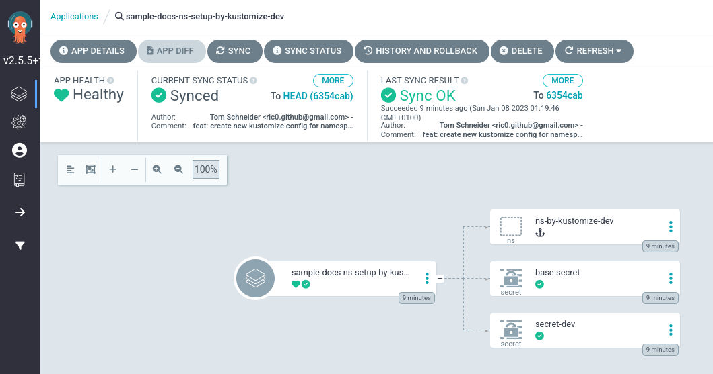

# Simple Docs Namespace Setup

This repo contains Kubernetes/kustomize config with multiple overlays to create some secrets.

This repo is part of an ArgoCD experiment, see https://github.com/ric03/sample-docs-argocd

<picture>
  <source media="(prefers-color-scheme: dark)" srcset="https://github.com/ric03/sample-docs-argocd/raw/main/docs/component-overview-transparent-darkmode.png">
  
</picture>


# Creating the namespace with Kustomize

We can use either a Hook or SyncWave annotation to create a namespace.
The Benefit of create it by kustomize is, that the namespace is destroyed when the ArgoCD-Appset is deleted.
The current version of ArgoCD does not delete created namespace, they have plans but the feature may take some time.

**Using the sync-wave:**

```yaml
name: Namespace
metadate:
  name: namespace-setup-with-syncwave
  annotations:
    argocd.argoproj.io/sync-wave: "-1"
```

The Sync-Wave currently has no visible Icon in the UI.

**Using the PreSync hook:**

```yaml
name: Namespace
metadate:
  name: namespace-setup-with-hook
  annotations:
    argocd.argoproj.io/hook: PreSync
```

The Hook is visible in the UI as an anchor icon:


