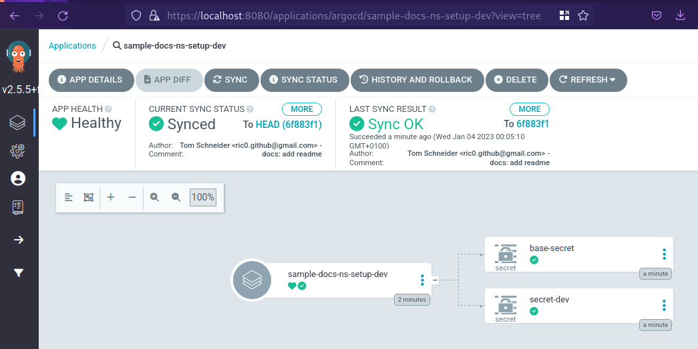

# Simple Docs Namespace Setup

This repo contains Kubernetes/kustomize config with multiple overlays to create some secrets.

This repo is part of an ArgoCD experiment, see https://github.com/ric03/sample-docs-argocd

<picture>
  <source media="(prefers-color-scheme: dark)" srcset="https://github.com/ric03/sample-docs-argocd/raw/main/docs/component-overview-transparent-darkmode.png">
  
</picture>

